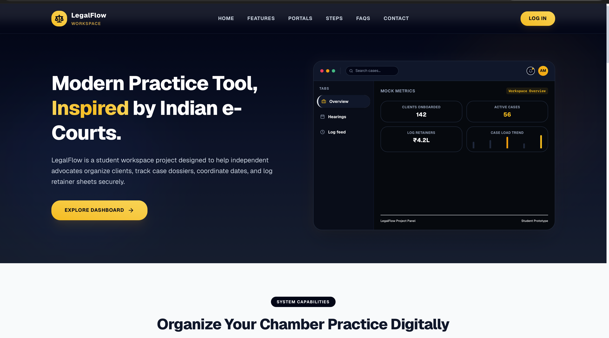
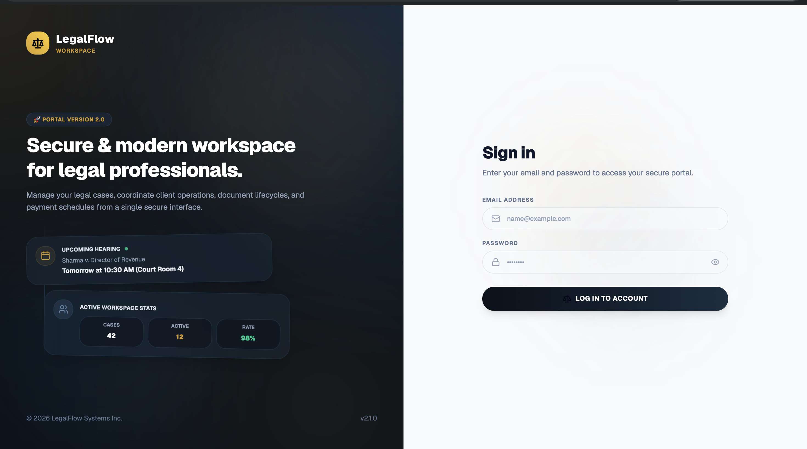
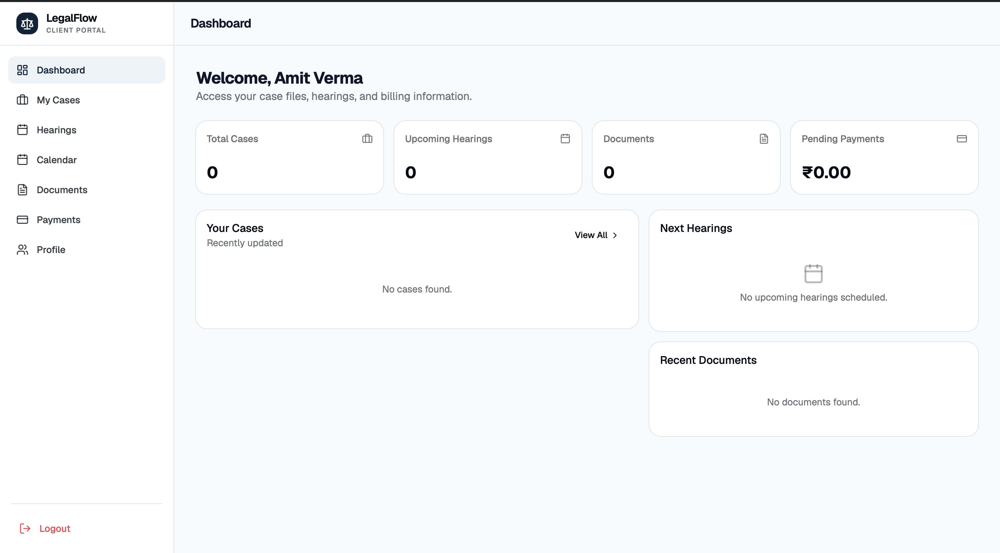
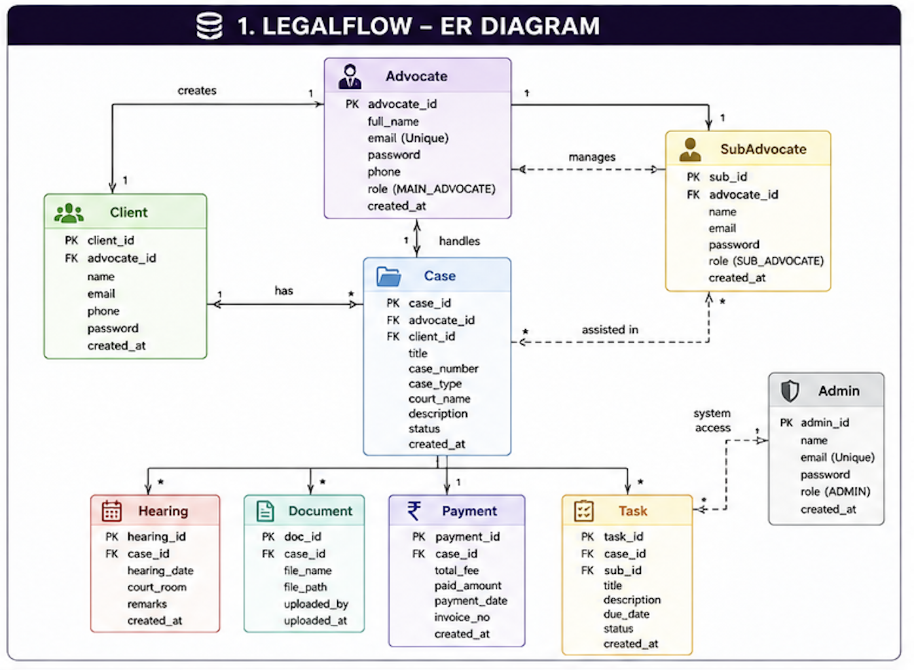
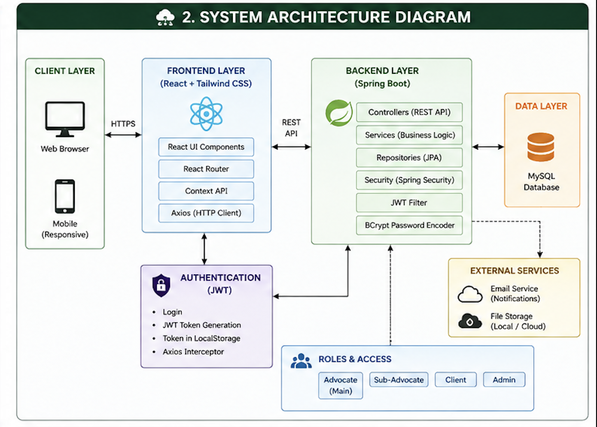
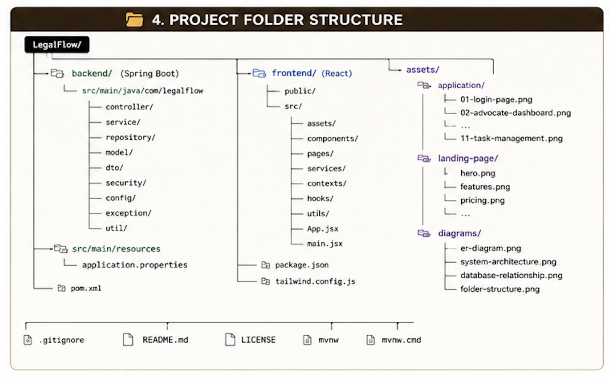

# LegalFlow

  
  
  
  
  
  
  

> Modern legal practice management platform for law firms, advocates, and clients.

LegalFlow is a full-stack application designed to streamline legal operations through secure access, role-based permissions, case management, hearings, documentation, payments, and task tracking.

---

## Overview

LegalFlow helps law firms manage internal workflows and client communication in a structured and secure way. The system is designed around a role-based model where:

- Main Advocate manages firm-wide operations
- Sub-Advocates handle assigned cases and tasks
- Clients access their case information and documentation

This project demonstrates a professional legal tech workflow with a modern interface and scalable architecture.

---

## Live Demo Access

### Demo Accounts

| Role | Email | Password |
|------|-------|----------|
| Main Advocate | saquib@gmail.com | 12345 |
| Sub Advocate | abdur@gmail.com | abdur@123 |
| Client | sarim@gmail.com | sarim@123 |

> Note: The backend may take a few seconds to start on a free hosting tier during the first request.

---

## Key Features

- Role-based access control for different user types
- Advocate and client management
- Case lifecycle tracking
- Hearing scheduling and updates
- Document management
- Payment and invoice handling
- Task assignment and monitoring
- Secure authentication using JWT
- Responsive dashboard interfaces

---

## Project Showcase

### Landing Page

### Application Screenshots

| Login | Advocate Dashboard |
|-------|--------------------|
|  |  |

| Sub-Advocate Dashboard | Client Dashboard |
|------------------------|-----------------|
|  |  |

---

## System Design

### ER Diagram

### System Architecture

### Database Relationship Diagram

### Project Structure

---

## Tech Stack

| Category | Technologies |
|----------|--------------|
| Backend | Java 21, Spring Boot 3.5 |
| Frontend | React.js, HTML5, CSS3, JavaScript |
| Database | MySQL |
| Authentication | Spring Security, JWT |
| ORM | Spring Data JPA, Hibernate |
| Build Tool | Maven |
| Version Control | Git, GitHub |
| IDE | IntelliJ IDEA, VS Code |

---

## Project Information

| Field | Details |
|-------|---------|
| Project Type | Full-Stack Web Application |
| Status | Active Development |
| Backend | Spring Boot |
| Frontend | React |
| Database | MySQL |
| Authentication | JWT |
| Deployment | Cloud-hosted demo |

---

## Roadmap

- Admin dashboard
- Email notifications
- Calendar integration
- Analytics dashboard
- Cloud deployment improvements
- Audit trail and permissions management
- Mobile application support

---

## Repository Notes

This repository serves as a professional portfolio and product showcase for LegalFlow. It includes the design previews, architecture diagrams, and documentation that highlight the system’s value, workflow, and visual identity.

---

## Author

Abdurrahman Khan

Email: abdurrahmankhan1429@gmail.com

---

  <strong>LegalFlow</strong> — Built for modern legal operations.

